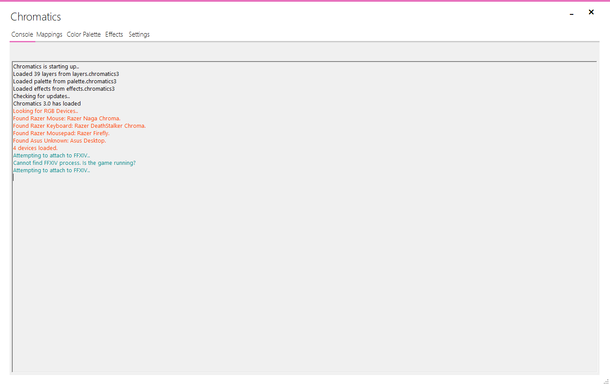

---
metaLinks:
  alternates:
    - https://app.gitbook.com/s/DpGqSy4CPpGNrMRyhQGc/using-chromatics/console
---

# Console

<figure><figcaption></figcaption></figure>

The console window shows information about how the application is running.
