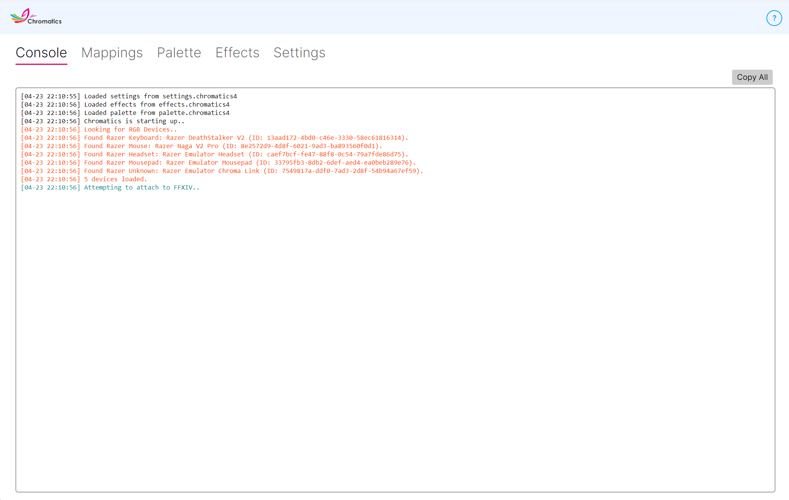

---
metaLinks:
  alternates:
    - https://app.gitbook.com/s/DpGqSy4CPpGNrMRyhQGc/using-chromatics/console
---

# Console

<figure><figcaption></figcaption></figure>

The **Console** tab is the first thing Chromatics opens to, and it gives you a live view of what the app is doing behind the scenes.

## What you'll see here

* **Startup messages** — which device providers loaded, which devices were detected, and any warnings from your vendor SDKs.
* **Game connection status** — whether Chromatics has connected to Final Fantasy XIV and is reading game data.
* **Runtime events** — weather changes, zone changes, and other notable things Chromatics reacts to.
* **Errors and warnings** — if something goes wrong, it will appear here first.

You can scroll through the log while Chromatics is running. New entries are added at the bottom as they happen.

## When to check the Console

Most of the time you don't need to look at the Console — Chromatics just works. But it's the first place to check if:

* A device isn't lighting up the way you expect.
* Effects aren't triggering in game.
* You're about to report a bug and want to know what Chromatics is actually doing.

## Collecting logs for support

If you're filing a bug report or asking for help, the log here is useful — but the easier option is **Settings → Advanced → Collect Logs**, which bundles the console output, your config files, and some system info into a single ZIP you can share.

See [Troubleshooting](../support/troubleshooting.md) for more help.
