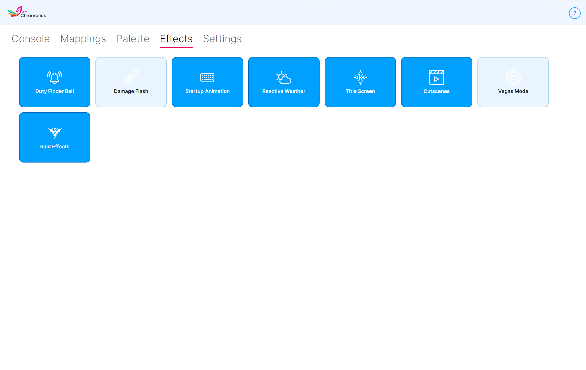

---
metaLinks:
  alternates:
    - https://app.gitbook.com/s/DpGqSy4CPpGNrMRyhQGc/using-chromatics/effects
---

# Effects

The **Effects** tab is a set of simple on/off switches for Chromatics' animated effects. Click any tile to toggle it — there's nothing else to configure here.

<figure><figcaption></figcaption></figure>

Some effects paint across the entire device (the **base layer**), some interrupt your lighting with a brief flash (the **effect layer**). See [Mappings](mappings.md) and [Layer Types](ffxiv-functions.md) if that's new to you.

## Available effects

<table><thead><tr><th width="240">Effect</th><th>Description</th></tr></thead><tbody>
<tr><td><strong>Startup Animation</strong></td><td>A rainbow gradient that plays across your devices while Chromatics is starting up and hasn't connected to the game yet.  <em>Affects: the whole device.</em></td></tr>
<tr><td><strong>Title Screen</strong></td><td>A gentle animation while you're on the FFXIV title screen or character selection screen.  <em>Affects: Effect layer.</em></td></tr>
<tr><td><strong>Duty Finder Bell</strong></td><td>Flashes your devices when a Duty Finder queue pops and is ready to accept.  <em>Affects: Effect layer.</em></td></tr>
<tr><td><strong>Damage Flash</strong></td><td>A brief flash when your character takes damage. By default the strength of the flash scales with the size of the hit.  <em>Affects: Effect layer.</em></td></tr>
<tr><td><strong>Reactive Weather</strong></td><td>Plays animated weather effects that match the current zone — gentle rain, rolling thunder, sandstorms, and so on. Works together with the <strong>Reactive Weather</strong> base layer on the <a href="mappings.md">Mappings</a> tab.  <em>Affects: Base layer.</em></td></tr>
<tr><td><strong>Cutscenes</strong></td><td>A subtle animation while in-game cutscenes are playing.  <em>Affects: Effect layer.</em></td></tr>
<tr><td><strong>Vegas Mode</strong></td><td>Cycles your devices through colourful animations while you're in the Gold Saucer.  <em>Affects: Base layer.</em></td></tr>
<tr><td><strong>Raid Effects</strong></td><td>Choreographed animations that take over your lighting during supported raid encounters. Uses zone-entry, phase-change, and music-driven transitions to stay in sync with the fight.  <em>Affects: Base layer.</em></td></tr>
</tbody></table>

## About Raid Effects

When Raid Effects is on and you enter a supported encounter, Chromatics temporarily replaces your base layer with a scripted animation for that encounter. Effects include arena pulses, ripples, colour washes, and rhythmic beat-synced patterns.

Supported encounters include the Dawntrail **Arcadion** raid series (M1–M8), **Cloud of Darkness** sequels, and the **Everkeep** normal and savage fights. Chromatics also reacts to music changes mid-fight — when a phase transition cuts the music, the lighting blacks out briefly to match.

If you're in an unsupported encounter, your normal base layer plays as usual, so you lose nothing by leaving Raid Effects on.


Raid colours can be customised in the <a href="palettes.md">Palette</a> tab under the <strong>Raid Zone Effects</strong> category.


## Advanced effect settings

Some fine-grained effect options aren't exposed in the UI and can only be changed by editing `effects.chromatics4` in `%AppData%\Chromatics\`. Most users should never need to touch these, but they're documented here for completeness.

<table><thead><tr><th width="340">Setting</th><th>Description</th></tr></thead><tbody>
<tr><td><code>effect_damageflash_scaledamage</code></td><td>Scale the Damage Flash opacity with the size of the hit. Default <code>true</code>.</td></tr>
<tr><td><code>effect_damageflash_min_flash</code></td><td>Minimum Damage Flash opacity when scaling is enabled. Default <code>0.1</code> (range <code>0.1</code>–<code>1.0</code>).</td></tr>
<tr><td><code>weather_*_animation</code></td><td>Enable or disable the animated form of each weather type individually. There is one toggle per weather type (rain, showers, wind, gales, thunder, snow, blizzard, sandstorms, umbral wind, umbral static, umbral light, umbral storms, Mare Lamentorum and Ultima Thule variants, etc.). All default to <code>true</code>. Setting one to <code>false</code> falls back to the static colour for that weather type.</td></tr>
</tbody></table>


Always close Chromatics before editing <code>effects.chromatics4</code> by hand, or your changes will be overwritten when Chromatics next saves.

