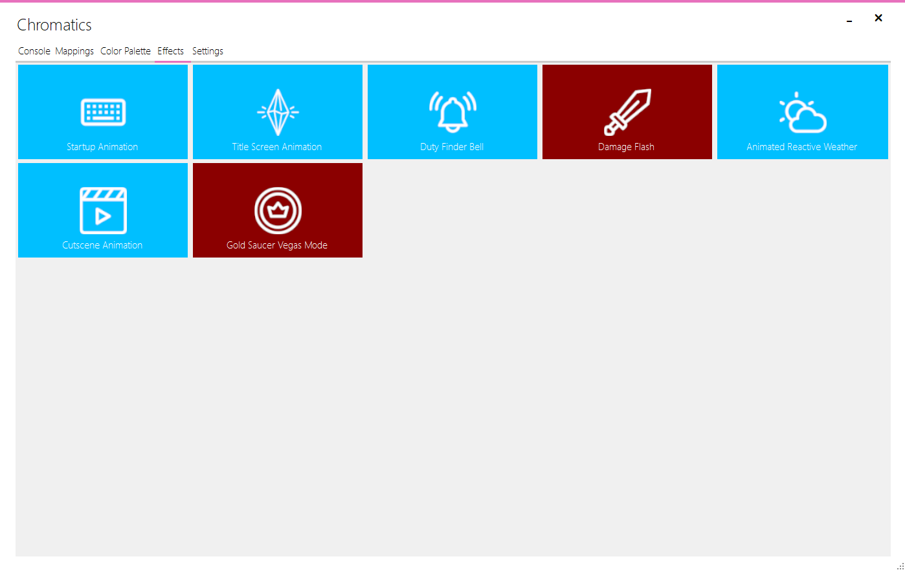

---
metaLinks:
  alternates:
    - https://app.gitbook.com/s/DpGqSy4CPpGNrMRyhQGc/using-chromatics/effects
---

# Effects

Chromatics 3 has a number of built in effects which can be enabled or disabled on the Effects tab. Effects are layers which show animated lighting on your devices for various circumstances.

To enable/disable an effect, simply click on the desired effect to toggle it.

<figure><figcaption></figcaption></figure>

<table><thead><tr><th width="243">Effect</th><th>Description</th></tr></thead><tbody><tr><td>Startup Animation</td><td>When Chromatics first starts and/or is not connected to FFXIV, it displays a rainbow gradient effect over all devices.</td></tr><tr><td>Title Screen Animation</td><td>While the game is on the main menu or character selection screen, this animation is shown on your devices.</td></tr><tr><td>Duty Finder Bell</td><td>Flashes your devices when a Duty Finder instance has popped and ready to queue in. <em><strong>Affected Layer:</strong> Effect layer</em></td></tr><tr><td>Damage Flash</td><td>Flashes when your character takes damage. By default the flash amount is determined by the amount of damage taken. <em><strong>Affected Layer:</strong> Effect layer</em></td></tr><tr><td>Animation Reactive Weather</td><td>Shows various animated effects depending on the type of weather active in your current zone. <em><strong>Affected Layer:</strong> Base layer</em></td></tr><tr><td>Cutscene Animation</td><td>While in a cutscene, this animation is displayed. <em><strong>Affected Layer:</strong> Effect layer</em></td></tr><tr><td>Gold Saucer Vegas Mode</td><td>While in the gold saucer, this animation is displayed. <em><strong>Affected Layer:</strong> Base layer</em></td></tr><tr><td>Raid Zone Effects</td><td>Shows animations using reactive weather layers for raid zones. Only implemented for Dawntrail currently. <em><strong>Affected Layer:</strong> Base layer</em></td></tr></tbody></table>

##

## Advanced Effect Controls

Some effects have extra controls that are not configurable in the UI. To change these settings you need to manually edit the effects.chromatics3 file in your installation directory.

<table><thead><tr><th width="317">Setting</th><th>Description</th></tr></thead><tbody><tr><td>effect_damageflash_scaledamage</td><td>Enable/disable the flash opacity being determined by the amount of damage taken. <em><strong>Effect:</strong> Damage Flash</em> <em><strong>Default:</strong> true</em> <em><strong>Values:</strong> true/false</em></td></tr><tr><td>effect_damageflash_min_flash</td><td>Sets the minimum opacity amount when scale damage is enabled. <em><strong>Effect:</strong> Damage Flash</em> <em><strong>Default:</strong> 0.1</em> <em><strong>Values:</strong> 0.1-1.0</em></td></tr><tr><td>weather_marelametorum_animation</td><td>Enables animated weather in Mare Lametorum for Fair Skies &#x26; Moon Dust. <em><strong>Effect:</strong> Animated Reactive Weather</em> <em><strong>Default:</strong> true</em> <em><strong>Values:</strong> true/false</em></td></tr><tr><td>weather_marelametorum_umbralwind_animation</td><td>Enables animated weather in Mare Lametorum for Umbral Wind. <em><strong>Effect:</strong> Animated Reactive Weather</em> <em><strong>Default:</strong> true</em> <em><strong>Values:</strong> true/false</em></td></tr><tr><td>weather_ultimathule_animation</td><td>Enables animated weather in Ultima Thule. <em><strong>Effect:</strong> Animated Reactive Weather</em> <em><strong>Default:</strong> true</em> <em><strong>Values:</strong> true/false</em></td></tr><tr><td>weather_ultimathule_umbralwind_animation</td><td>Enables animated weather in Ultima Thule for Umbral Wind. <em><strong>Effect:</strong> Animated Reactive Weather</em> <em><strong>Default:</strong> true</em> <em><strong>Values:</strong> true/false</em></td></tr><tr><td>weather_rain_animation</td><td>Enables animated weather for Rain. <em><strong>Effect:</strong> Animated Reactive Weather</em> <em><strong>Default:</strong> true</em> <em><strong>Values:</strong> true/false</em></td></tr><tr><td>weather_showers_animation</td><td>Enables animated weather for Showers. <em><strong>Effect:</strong> Animated Reactive Weather</em> <em><strong>Default:</strong> true</em> <em><strong>Values:</strong> true/false</em></td></tr><tr><td>weather_wind_animation</td><td>Enables animated weather for Wind. <em><strong>Effect:</strong> Animated Reactive Weather</em> <em><strong>Default:</strong> true</em> <em><strong>Values:</strong> true/false</em></td></tr><tr><td>weather_gales_animation</td><td>Enables animated weather for Gales. <em><strong>Effect:</strong> Animated Reactive Weather</em> <em><strong>Default:</strong> true</em> <em><strong>Values:</strong> true/false</em></td></tr><tr><td>weather_thunder_animation</td><td>Enables animated weather for Thunder &#x26; Thunderstorms. <em><strong>Effect:</strong> Animated Reactive Weather</em> <em><strong>Default:</strong> true</em> <em><strong>Values:</strong> true/false</em></td></tr><tr><td>weather_astromagneticstorm_animation</td><td>Enables animated weather for Astromagnetic Storms. <em><strong>Effect:</strong> Animated Reactive Weather</em> <em><strong>Default:</strong> true</em> <em><strong>Values:</strong> true/false</em></td></tr><tr><td>weather_umbralwind_animation</td><td>Enables animated weather for Umbral Wind. <em><strong>Effect:</strong> Animated Reactive Weather</em> <em><strong>Default:</strong> true</em> <em><strong>Values:</strong> true/false</em></td></tr><tr><td>weather_umbralstatic_animation</td><td>Enables animated weather for Umbral Static. <em><strong>Effect:</strong> Animated Reactive Weather</em> <em><strong>Default:</strong> true</em> <em><strong>Values:</strong> true/false</em></td></tr><tr><td>weather_snow_animation</td><td>Enables animated weather for Snow. <em><strong>Effect:</strong> Animated Reactive Weather</em> <em><strong>Default:</strong> true</em> <em><strong>Values:</strong> true/false</em></td></tr><tr><td>weather_blizzard_animation</td><td>Enables animated weather for Blizzards. <em><strong>Effect:</strong> Animated Reactive Weather</em> <em><strong>Default:</strong> true</em> <em><strong>Values:</strong> true/false</em></td></tr><tr><td>weather_sandstorms_animation</td><td>Enables animated weather for Sandstorms and Duststorms. <em><strong>Effect:</strong> Animated Reactive Weather</em> <em><strong>Default:</strong> true</em> <em><strong>Values:</strong> true/false</em></td></tr><tr><td>weather_everlastinglight_animation</td><td>Enables animated weather for Everlasting Light. <em><strong>Effect:</strong> Animated Reactive Weather</em> <em><strong>Default:</strong> true</em> <em><strong>Values:</strong> true/false</em></td></tr></tbody></table>
