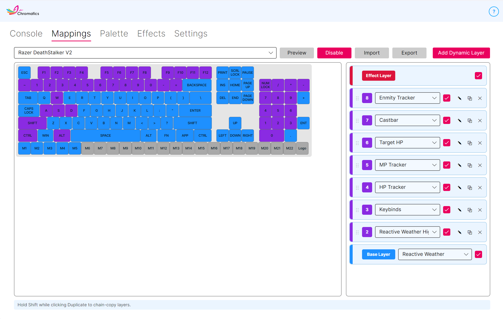

---
metaLinks:
  alternates:
    - https://app.gitbook.com/s/DpGqSy4CPpGNrMRyhQGc/using-chromatics/mappings
---

# Mappings

The **Mappings** tab is the heart of Chromatics. It's where you decide what each of your devices does and how your lighting is laid out.

Chromatics uses a simple **layer** system: every device has a stack of layers, and each layer controls a specific piece of behaviour — a solid background colour, your HP bar, your cast bar, and so on. Higher layers paint over lower ones, exactly like layers in image editing software.

A default layer setup is already in place the first time you open Chromatics, so you have something working to build on.

## Layer types

Chromatics supports three kinds of layers. See [Layer Types](ffxiv-functions.md) for the full reference.

### Base layer

The **Base Layer** always sits at the bottom of the stack. It covers every key or LED on your device and is usually used for a solid background colour or a whole-device effect like Reactive Weather or the Audio Visualizer. Each device has exactly one base layer — you can't add another, move it, or remove it.

### Dynamic layer

**Dynamic Layers** are where most of the game-driven magic happens. They sit on top of the base layer and can be assigned to any subset of keys or LEDs you like — an HP bar across your function row, a job gauge across your number keys, keybind lighting across your ability keys.

You can stack as many dynamic layers as you want, reorder them, and enable or disable them individually.

### Effect layer

The **Effect Layer** sits at the very top of the stack and covers the whole device. Quick flashes — such as the Duty Finder Bell and Damage Flash — use this layer so they show above everything else. Like the base layer, each device has exactly one effect layer and it cannot be moved or removed.

## The Mappings screen

<figure><figcaption></figcaption></figure>

<table><thead><tr><th width="95"></th><th></th></tr></thead><tbody>
<tr><td><strong>A</strong></td><td><strong>Device Selection</strong> Choose which device you're editing. Every device has its own independent stack of layers.</td></tr>
<tr><td><strong>B</strong></td><td><strong>Import Layers</strong> Load a layer file from disk. This replaces your current layer setup for every device. Chromatics 3 files (<code>.chromatics3</code>) are also accepted.</td></tr>
<tr><td><strong>C</strong></td><td><strong>Export Layers</strong> Save your current layer setup to a file so you can back it up or share it.</td></tr>
<tr><td><strong>D</strong></td><td><strong>Preview Layers</strong> Show what your layers look like on the selected device without needing the game running.</td></tr>
<tr><td><strong>E</strong></td><td><strong>Layer Type to Add</strong> Chooses the type of layer the <strong>Add</strong> button will create. Dynamic is the only option you can add manually.</td></tr>
<tr><td><strong>F</strong></td><td><strong>Add Layer</strong> Adds a new dynamic layer directly above the base layer. Base and Effect layers cannot be added — they already exist.</td></tr>
<tr><td><strong>G</strong></td><td><strong>Layer ID</strong> A unique ID for the layer that also shows its stack order. Higher IDs sit on top of lower ones.  You can drag and drop dynamic layers to change their order. The base and effect layers are always pinned at the bottom and top of the stack.</td></tr>
<tr><td><strong>H</strong></td><td><strong>Layer Type</strong> Shows whether this row is a Base, Dynamic, or Effect layer.</td></tr>
<tr><td><strong>I</strong></td><td><strong>Layer Function</strong> The behaviour attached to this layer — the HP tracker, the keybind highlight, reactive weather, and so on. See <a href="ffxiv-functions.md">Layer Types</a> for the full list.</td></tr>
<tr><td><strong>J</strong></td><td><strong>Layer Enable</strong> Turn this layer on or off without deleting it.</td></tr>
<tr><td><strong>K</strong></td><td><strong>Edit Layer</strong> Switch to edit mode so you can choose which keys or LEDs this layer covers.</td></tr>
<tr><td><strong>L</strong></td><td><strong>Delete / Copy Layer</strong> Delete the selected layer. <strong>Hold Shift</strong> while clicking to duplicate the layer instead.</td></tr>
<tr><td><strong>M</strong></td><td><strong>Enable Bleeding</strong> Controls what happens when the layer has nothing to display. With bleeding <em>off</em>, empty areas are filled with the layer's negative colour (usually black). With bleeding <em>on</em>, empty areas become transparent so the layer below shows through. See <a href="#layer-bleeding">Layer bleeding</a> below.</td></tr>
<tr><td><strong>N</strong></td><td><strong>Layer Mode</strong> Some layer types support different display modes — typically <em>Interpolate</em> or <em>Fade</em>. See <a href="#layer-modes">Layer modes</a>.</td></tr>
<tr><td><strong>O</strong></td><td><strong>Undo</strong> While editing a layer, revert your most recent key selection change.</td></tr>
<tr><td><strong>P</strong></td><td><strong>Reverse</strong> While editing, flip the currently selected keys. Useful for rapidly building mirrored layouts.</td></tr>
<tr><td><strong>Q</strong></td><td><strong>Clear</strong> While editing, deselect every key. Clearing also exits edit mode.</td></tr>
<tr><td><strong>R</strong></td><td><strong>Key Selection</strong> The visual layout of your device. Click keys or LEDs to include or exclude them from the layer you are editing.</td></tr>
</tbody></table>

## Layer bleeding

Most layers don't have something to show at every moment. An HP bar, for example, only lights up the keys that represent your current HP — the rest would normally be dark.

* **Bleeding off** (default for most layers) — the layer paints the empty keys with its **negative colour** (usually black). You see a clean bar with a dark background.
* **Bleeding on** — the empty keys become transparent, and whatever is underneath (the next layer down, or ultimately the base layer) shows through.

Layer bleeding is what lets you combine several dynamic layers without them painting over each other. A common pattern is keybinds on bleeding layers above a solid base colour so your inactive keys still show a pleasant background.

## Layer modes

Some dynamic layers can display in different ways depending on the kind of device you're on.

### Interpolate

The layer spreads its values smoothly across the selected keys in order. This is ideal on keyboards and other devices with straight rows of keys — an HP bar that fills left-to-right, for example.

### Fade

The layer fades every selected key between two colours as a single group. This works better on devices without a linear layout, such as mousepads, light strips, or Hue bulbs.

## Keyboard layouts

Chromatics supports **QWERTY**, **QWERTZ**, and **AZERTY** keyboards. The layout is set in **Settings → Appearance & Language → Keyboard Layout**. Changing it remaps your existing layers automatically so your mappings stay correct on the new layout — no need to rebuild anything.


If you use a layout other than the one set here, your physical keys might light up in positions that look unusual. Switch to the matching layout in Settings and Chromatics will realign everything.


## Tips for building your first setup

* Start from the default layers and tweak a little at a time.
* Use the **Preview Layers** button to test designs without launching the game.
* **Export** frequently. A layer file is small and easy to back up.
* Swap layer order by drag-and-drop — dynamic layers at the top paint on top.
* If things look wrong, toggle **Layer Enable** on each layer to narrow down which one is misbehaving.
