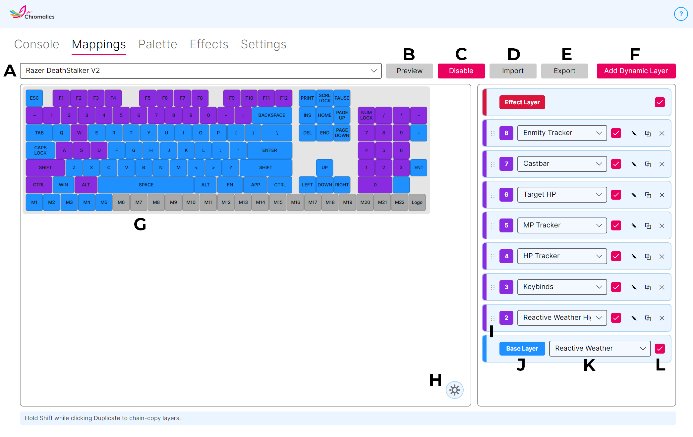
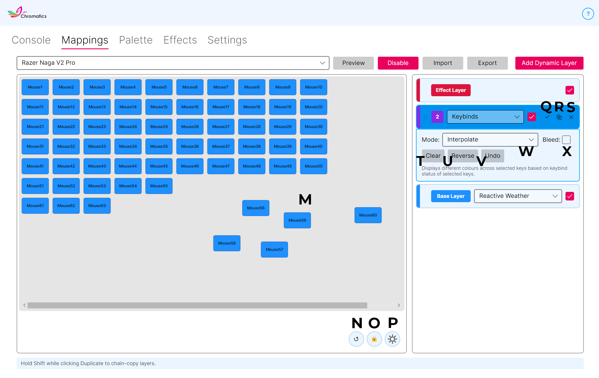

---
metaLinks:
  alternates:
    - https://app.gitbook.com/s/DpGqSy4CPpGNrMRyhQGc/using-chromatics/mappings
---

# Mappings

The **Mappings** tab is the heart of Chromatics. It's where you decide what each of your devices does and how your lighting is laid out.

Chromatics uses a simple **layer** system: every device has a stack of layers, and each layer controls a specific piece of behaviour - a solid background colour, your HP bar, your cast bar, and so on. Higher layers paint over lower ones, exactly like layers in image editing software.

A default layer setup is already in place the first time you open Chromatics, so you have something working to build on.

## Layer types

Chromatics supports three kinds of layers. See [Layer Types](ffxiv-functions.md) for the full reference.

### Base layer

The **Base Layer** always sits at the bottom of the stack. It covers every key or LED on your device and is usually used for a solid background colour or a whole-device effect like Reactive Weather or the Audio Visualizer. Each device has exactly one base layer - you can't add another, move it, or remove it.

### Dynamic layer

**Dynamic Layers** are where most of the game-driven magic happens. They sit on top of the base layer and can be assigned to any subset of keys or LEDs you like - an HP bar across your function row, a job gauge across your number keys, keybind lighting across your ability keys.

You can stack as many dynamic layers as you want, reorder them, and enable or disable them individually.

### Effect layer

The **Effect Layer** sits at the very top of the stack and covers the whole device. Quick flashes - such as the Duty Finder Bell and Damage Flash - use this layer so they show above everything else. Like the base layer, each device has exactly one effect layer and it cannot be moved or removed.

The **enable toggle** on the Effect Layer row is also a **per-device master switch for everything on the [Effects](effects.md) tab**. Turn it off for a device and that device stops playing raid effects, the duty-finder bell, the damage flash, the cutscene animation, vegas mode, the startup and title-screen animations, and any reactive-weather animation overlays. The base layer (static colours, job class colours, weather colour, screen capture) and your dynamic layers (HP, target, keybinds, etc.) keep running normally on that device.

Useful when you want, say, raid effects roaring across your keyboard but not your light strips behind the monitor - turn the Effect Layer off on the strips and they'll keep painting your base colours during the fight.

## The Mappings screen

<figure><figcaption></figcaption></figure>

<table><thead><tr><th width="95"></th><th></th></tr></thead><tbody>
<tr><td><strong>A</strong></td><td><strong>Device Selection</strong> Choose which device you're editing. Every device has its own independent stack of layers.</td></tr>
<tr><td><strong>B</strong></td><td><strong>Preview Layers</strong> Preview your current layer setup on the selected device without needing the game to be running.</td></tr>
<tr><td><strong>C</strong></td><td><strong>Toggle Device</strong> Enable or disable lighting output to this device entirely. The setting persists across restarts. For Hue and LIFX bulbs, disabling here returns the bulb to the colour and on/off state it had before Chromatics took over.</td></tr>
<tr><td><strong>D</strong></td><td><strong>Import Layers</strong> Load a layer file from your PC. This replaces your current layer setup for every device. Chromatics 3 files (<code>.chromatics3</code>) are also accepted.</td></tr>
<tr><td><strong>E</strong></td><td><strong>Export Layers</strong> Save your current layer setup to a file so you can back it up or share it.</td></tr>
<tr><td><strong>F</strong></td><td><strong>Add Layer</strong> Adds a new dynamic layer directly above the base layer. Base and Effect layers cannot be added - they already exist by default.</td></tr>
<tr><td><strong>G</strong></td><td><strong>Virtual Keyboard</strong> An on-screen representation of your keyboard. While editing a layer, click keys here to include or exclude them from the layer.</td></tr>
<tr><td><strong>H</strong></td><td><strong>Device Brightness</strong> Controls the brightness of this device independently of the <a href="settings.md#global-brightness">Global Brightness</a> setting.</td></tr>
<tr><td><strong>I</strong></td><td><strong>Layer ID</strong> A unique ID for each layer, which also shows its position in the stack. Higher IDs sit on top of lower ones.  You can drag and drop dynamic layers to change their order. The base and effect layers are always pinned at the bottom and top of the stack.</td></tr>
<tr><td><strong>J</strong></td><td><strong>Layer Type</strong> Shows whether this row is a Base, Dynamic, or Effect layer.</td></tr>
<tr><td><strong>K</strong></td><td><strong>Layer Function</strong> The behaviour attached to this layer - the HP tracker, keybind highlight, reactive weather, and so on. See <a href="ffxiv-functions.md">Layer Types</a> for the full list.</td></tr>
<tr><td><strong>L</strong></td><td><strong>Layer Enable</strong> Turn this layer on or off without deleting it.</td></tr>
</tbody></table>

<figure><figcaption></figcaption></figure>

<table><thead><tr><th width="95"></th><th></th></tr></thead><tbody>
<tr><td><strong>M</strong></td><td><strong>Virtual Device</strong> An on-screen representation of a non-keyboard device (such as a mouse, mousepad, or light strip). Click buttons or zones to include them in the layer you're editing. When the layout is unlocked, you can also drag buttons to rearrange them - useful for position-based effects.</td></tr>
<tr><td><strong>N</strong></td><td><strong>Reset Layout</strong> For non-keyboard devices only. Resets the positions of all buttons back to their default grid layout.</td></tr>
<tr><td><strong>O</strong></td><td><strong>Lock Layout</strong> Locks or unlocks the virtual device so you can drag buttons into custom positions. Useful for position-based effects that rely on 2D coordinates.</td></tr>
<tr><td><strong>P</strong></td><td><strong>Device Brightness</strong> Controls the brightness of this device independently of the <a href="settings.md#global-brightness">Global Brightness</a> setting.</td></tr>
<tr><td><strong>Q</strong></td><td><strong>Edit Layer</strong> Switch into edit mode for this layer so you can choose which keys or LEDs it covers.</td></tr>
<tr><td><strong>R</strong></td><td><strong>Duplicate Layer</strong> Creates a copy of the selected layer, useful when you want two similar layers with minor differences.</td></tr>
<tr><td><strong>S</strong></td><td><strong>Delete Layer</strong> Deletes the selected layer. This cannot be undone, so export first if you'd like to keep a copy.</td></tr>
<tr><td><strong>T</strong></td><td><strong>Clear</strong> While editing a layer, deselects every key. Clearing also exits edit mode.</td></tr>
<tr><td><strong>U</strong></td><td><strong>Reverse</strong> While editing a layer, flips your current key selection - every selected key becomes unselected and vice versa. Useful for quickly building the inverse of a selection.</td></tr>
<tr><td><strong>V</strong></td><td><strong>Undo</strong> While editing a layer, reverts your most recent key selection change.</td></tr>
<tr><td><strong>W</strong></td><td><strong>Layer Mode</strong> Some layer types support different display modes - typically <em>Interpolate</em> or <em>Fade</em>. See <a href="#layer-modes">Layer modes</a> below.</td></tr>
<tr><td><strong>X</strong></td><td><strong>Enable Bleeding</strong> Controls what happens when the layer has nothing to display. With bleeding <em>off</em>, empty areas are filled with the layer's negative colour (usually black). With bleeding <em>on</em>, empty areas become transparent so the layer below shows through. See <a href="#layer-bleeding">Layer bleeding</a> below.</td></tr>
</tbody></table>

## Copying layers between devices

If you have multiple devices and want them to share the same setup (an HP layer on every keyboard you own, for example), you can copy every layer from one device onto another without rebuilding it by hand. Look for the small **copy** icon next to the brightness button in the bottom-right of the virtual device preview.

Click it to open the **Copy layers between devices** dialog:

* Pick the **source device** (defaults to the one you currently have selected in the Mappings tab).
* Pick a **destination device**.
* The dialog computes a default LED-to-LED mapping and shows it in a scrollable list, with the source LED on the left and the destination LED on the right. Override any row by picking a different destination LED from its dropdown.
* Click **Copy layers** to duplicate every layer from the source onto the destination. Original layers on the source are left untouched.

**Cross-device rules:**

* **Keyboards can only copy to other keyboards.** Chromatics uses a consistent keyboard layout across vendors, so an Esc key on a Razer board lands on the Esc key of a Logitech, Alienware, or Dynamic Lighting board automatically - no manual remapping needed for the standard ANSI 104.
* **Everything else can cross device types.** You can copy a mouse setup onto a headset, a chassis onto a strip, etc. The default mapping matches LEDs by their ID where the destination has an exact match, and falls back to positional index match otherwise. Use the per-row override dropdown to nudge any LED that didn't land where you wanted.

Any source LED that has no matching destination LED is shown without a destination dropdown selection. Those LEDs are skipped on copy - the summary line above the buttons tells you how many will be dropped before you confirm.

## Layer bleeding

Most layers don't have something to show at every moment. An HP bar, for example, only lights up the keys that represent your current HP - the rest would normally be dark.

* **Bleeding off** (default for most layers) - the layer paints the empty keys with its **negative colour** (usually black). You see a clean bar with a dark background.
* **Bleeding on** - the empty keys become transparent, and whatever is underneath (the next layer down, or ultimately the base layer) shows through.

Layer bleeding is what lets you combine several dynamic layers without them painting over each other. A common pattern is keybinds on bleeding layers above a solid base colour so your inactive keys still show a pleasant background.

## Layer modes

Some dynamic layers can display in different ways depending on the kind of device you're on.

### Interpolate

The layer spreads its values smoothly across the selected keys in order. This is ideal on keyboards and other devices with straight rows of keys - an HP bar that fills left-to-right, for example.

### Fade

The layer fades every selected key between two colours as a single group. This works better on devices without a linear layout, such as mousepads, light strips, or Hue bulbs.

## Keyboard layouts

Chromatics supports **QWERTY**, **QWERTZ**, and **AZERTY** keyboards. The layout is set in **Settings → Appearance & Language → Keyboard Layout**. Changing it remaps your existing layers automatically so your mappings stay correct on the new layout - no need to rebuild anything.


If you use a layout other than the one set here, your physical keys will light up in unexpected positions. Switch to the matching layout in Settings and Chromatics will realign everything.


## Tips for building your first setup

* Start from the default layers and tweak a little at a time.
* Use the **Preview Layers** button to test designs without launching the game.
* **Export** frequently. A layer file is small and easy to back up.
* Swap layer order by drag-and-drop - dynamic layers at the top paint on top.
* If things look wrong, toggle **Layer Enable** on each layer to narrow down which one is misbehaving.
