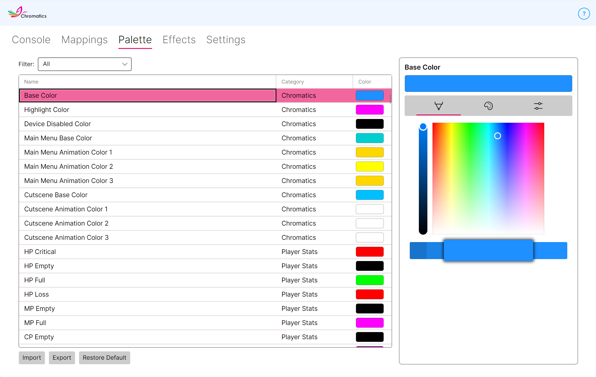

---
metaLinks:
  alternates:
    - https://app.gitbook.com/s/DpGqSy4CPpGNrMRyhQGc/using-chromatics/palettes
---

# Palettes

<figure><figcaption></figcaption></figure>

The **Palette** tab is where you customise the colours Chromatics uses for every effect, tracker, and animation. If you want an orange HP bar instead of green, or moody purples for your weather effects, this is where to change it.

Every layer and effect in Chromatics pulls its colours from a named palette entry. Editing a palette colour instantly changes every effect that uses it.

## Filtering by category

Chromatics has a lot of colours, so the category drop-down lets you narrow the list down to whatever you're actually working on.

| Category | Used for |
| --- | --- |
| **All** | Every palette entry. |
| **Chromatics** | Static Base layers, cutscene animations, startup animations, and other core visuals. |
| **Player Stats** | HP, MP, GP, CP, and Experience trackers. |
| **Abilities** | Your own castbar effects. |
| **Enmity / Aggro** | Enmity tracker stages. |
| **Target / Enemy** | Target HP tracker and target castbar. |
| **Status Effects** | Buff and debuff colouring. |
| **Cooldowns / Keybinds** | Keybind highlighting — available, on cooldown, unassigned. |
| **Notifications** | Things like the Duty Finder Bell and other alerts. |
| **Job Gauges** | Job Gauge A / B / C colours for every combat class. |
| **Reactive Weather** | Colours for every weather type — rain, thunder, snow, and so on. |
| **Job Classes** | The colour associated with each job / class. |
| **Raid Zone Effects** | Colours used by the choreographed raid-zone animations. |
| **Audio Visualizer** | Base, low, mid, and high frequency colours for the Audio Visualizer. |

## Editing colours

Click any colour swatch in the list to open the colour picker. You can enter values by:

* Picking from the visual colour wheel.
* Typing an RGB value.
* Typing a hex code.

Your change is applied immediately — no save button needed.

## Importing and exporting palettes

Use the two buttons to the right of the category drop-down to import or export your palette.

* **Export** saves your current palette to a file on your PC.
* **Import** loads a palette file, replacing your current one. Both `.chromatics4` and older `.chromatics3` palette files are accepted.


Have a palette you love? Share it with other Chromatics users in our [Discord](https://discord.gg/A7nXaGAK7k). You can also pick up palettes shared by the community.


## Resetting a palette

If you want to undo your changes, the easiest path is to re-import the default palette file (available from Discord or your original installation). A full factory reset is also available in [Settings → Advanced → Reset Chromatics](settings.md#reset-chromatics), which clears all customisation and starts fresh.
