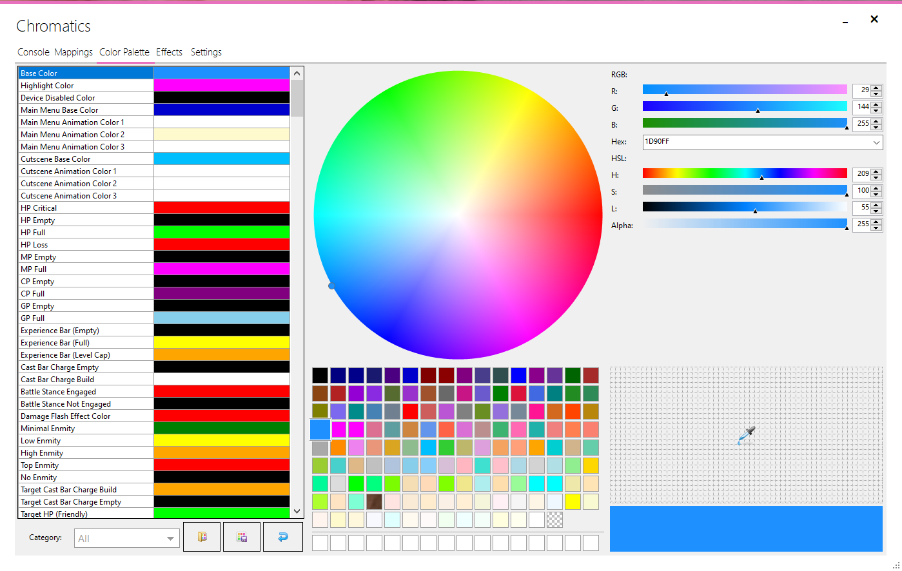

---
metaLinks:
  alternates:
    - https://app.gitbook.com/s/DpGqSy4CPpGNrMRyhQGc/using-chromatics/palettes
---

# Palettes

<figure><figcaption></figcaption></figure>

The Color Palette tab allows you to re-assign any colours used by Chromatics effects.

### Category

You can easily filter down the palette list by the category drop-down menu. The category options are as follows:

* **All -** Displays all palettes.&#x20;
* **Chromatics -** Palettes for Static Base Modes and Cutscene animation effects.
* **Player Stats -** Palettes for HP/MP/GP/GP Tracker and Experience Tracker.
* **Abilities -** Palettes for Castbar Effects.
* **Enmity/Aggro -** Palettes for Enmity Tracker.
* **Target/Enemy -** Palettes for Target HP Tracker.
* **Cooldowns/Keybinds -** Palettes for Keybind highlighting.
* **Job Gauges -** Palettes for Job Gauge Effects.
* **Reactive Weather -** Palettes for Reactive Weather.
* **Job Classes -** Palettes for Job Classes base mode.
* **Raid Zone Effects -** Palettes for Raid Zone effect animations.

### Import/Export Palette

Using the two buttons to the right of the category selection, you can import and export your personalised color palettes. You can also import palettes from Chromatics 2.


You can share your color palettes with other Chromatics users by joining our [Discord channel](https://discord.gg/sK47yFE).

