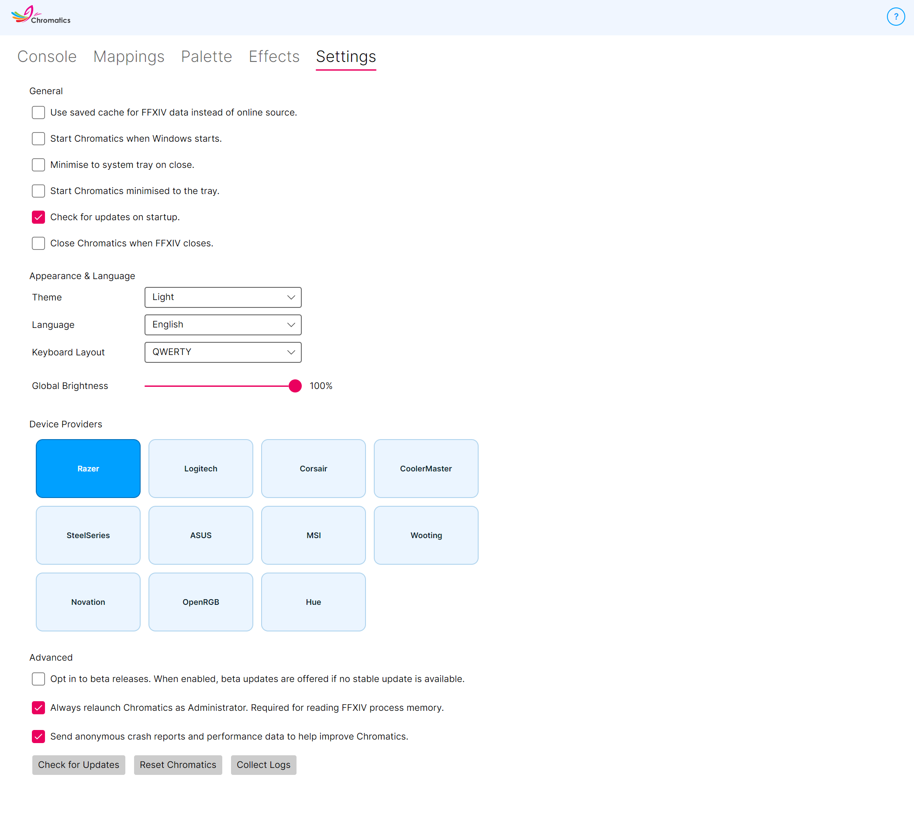

---
metaLinks:
  alternates:
    - https://app.gitbook.com/s/DpGqSy4CPpGNrMRyhQGc/using-chromatics/settings
---

# Settings

<figure><figcaption></figcaption></figure>

The **Settings** tab is where you tune how Chromatics behaves, what devices it talks to, and how the app looks. Settings are saved automatically as you change them.

Settings are grouped into four sections.

* [General](#general) — day-to-day behaviour.
* [Appearance & Language](#appearance-and-language) — theme, language, keyboard layout, global brightness.
* [Device Providers](#device-providers) — which RGB vendors Chromatics connects to.
* [Advanced](#advanced) — beta channel, crash reporting, reset, admin behaviour.

## General

### Use saved cache for FFXIV data

Chromatics downloads a small reference dataset on startup so it can recognise new content quickly after FFXIV patches. Turning this on makes it use a locally saved copy instead — useful if you're offline or on a metered connection.

**Default:** Disabled.

### Start Chromatics when Windows starts

Automatically launches Chromatics when you sign in to Windows. Pair this with **Start Chromatics minimised to the tray** below for a silent boot.

**Default:** Disabled.

### Minimise to system tray on close

When on, clicking the window's red **X** hides Chromatics to the system tray instead of closing it. You can still exit fully by right-clicking the tray icon and choosing **Close**.

**Default:** Disabled.

### Start Chromatics minimised to the tray

When on, launching Chromatics sends it straight to the system tray without ever showing the main window.

**Default:** Disabled.

### Check for updates on startup

Lets Chromatics check for new releases automatically when it starts. Updates are downloaded and applied in the background with a restart.

**Default:** Enabled.

### Close Chromatics when FFXIV closes

When on, Chromatics will exit automatically a few seconds after Final Fantasy XIV closes. Handy if you launch Chromatics alongside the game and don't want it lingering after you quit.

**Default:** Disabled.

## Appearance and Language

### Theme

Pick **Light**, **Dark**, or **System** (follows your Windows theme). The change applies instantly.

### Language

Chromatics is localised into several languages. Choose yours from the drop-down — the interface text updates immediately.

### Keyboard Layout

Tells Chromatics which physical layout your keyboard uses so key positions are correct. Options are **QWERTY**, **QWERTZ**, and **AZERTY**.

Changing this setting remaps your existing layer key assignments automatically so you don't need to rebuild anything. The virtual keyboard in the Mappings tab also re-renders to match.

**Default:** QWERTY.

### Global Brightness

A master brightness slider that scales every device's output from 0% (off) to 100% (full brightness). Use this to keep Chromatics subtle without editing every palette colour.

**Default:** 100%.

## Device Providers

This section shows a tile for every supported RGB provider. Click a tile to toggle that provider on or off.

Turning a provider off means Chromatics won't try to connect to its SDK at all, which can be useful for troubleshooting — for example, if one vendor's SDK is misbehaving you can disable it and keep the others working.

Supported providers:

* Razer
* Logitech
* Corsair
* Cooler Master
* SteelSeries
* Asus
* MSI
* Wooting
* Novation
* OpenRGB
* Philips Hue **(Beta)** — requires a one-time bridge pairing.


Changing which providers are enabled takes effect after you restart Chromatics.


### Philips Hue pairing

The first time you enable Philips Hue, Chromatics opens a small pairing dialog:

1. Enter the IP address of your Hue bridge.
2. Press the big round button on top of the bridge.
3. Click **Submit** in the dialog within about 30 seconds.

Chromatics remembers the pairing, so you won't be asked again unless your bridge's network details change.

## Advanced

### Opt in to beta releases

When on, Chromatics also checks the beta update feed and installs beta builds if they're newer than the current stable release. See [Beta Releases](../getting-started/beta-releases.md).

**Default:** Disabled.

### Always relaunch Chromatics as Administrator

Chromatics needs admin privileges to read FFXIV memory. When on, Chromatics will silently relaunch itself with admin rights instead of showing the usual relaunch prompt.

**Default:** Disabled.

### Send anonymous crash reports and performance data

Lets Chromatics send anonymous crash reports to help us catch and fix bugs faster. **No personally identifying information is collected** — just the crash itself, the app version, and basic environment info. If Chromatics crashes with this on, you'll also see a small dialog where you can optionally add a comment describing what you were doing.

**Default:** Enabled.

### Check for Updates

Runs an update check immediately. If a new version is available, Chromatics will download and install it.

### Reset Chromatics

Resets Chromatics back to defaults. All of your config files in `%AppData%\Chromatics\` are removed. You'll need to restart Chromatics afterwards and go through the First Run wizard again. Consider [exporting your layers and palettes](mappings.md) first if you think you might want them back.

### Collect Logs

Bundles the console log, your config files, and some basic system info into a single ZIP in a location of your choosing. Attach this ZIP when asking for support on Discord or GitHub — it gives us everything we need to help.

## Where are the old "Advanced Settings"?

A handful of deeper options that used to require editing `settings.chromatics3` by hand are now exposed in the UI (keyboard layout, global brightness, beta opt-in, admin elevation, device provider toggles). The only settings that still live in the file are very niche tuning values and can be changed by editing `settings.chromatics4` in `%AppData%\Chromatics\` while Chromatics is closed.

<table><thead><tr><th width="320">Setting</th><th>Description</th></tr></thead><tbody>
<tr><td><code>rgbRefreshRate</code></td><td>Refresh rate (in seconds) of the RGB rendering surface. Default <code>0.05</code>. Lower values are smoother but use more CPU. Values below <code>0.05</code> are not recommended. <em>Takes effect on restart.</em></td></tr>
<tr><td><code>criticalHpPercentage</code></td><td>The HP percentage at which the HP Tracker switches to its critical colour. Default <code>20.0</code>.</td></tr>
<tr><td><code>deviceHueBridgeIP</code> / <code>deviceHueBridgeKey</code> / <code>deviceHueBridgeStreamingKey</code></td><td>The Hue bridge credentials. Normally set automatically during pairing, but can be filled in by hand if you're restoring a backup.</td></tr>
</tbody></table>


Close Chromatics before editing <code>settings.chromatics4</code> by hand — otherwise your changes will be overwritten when Chromatics next saves.

