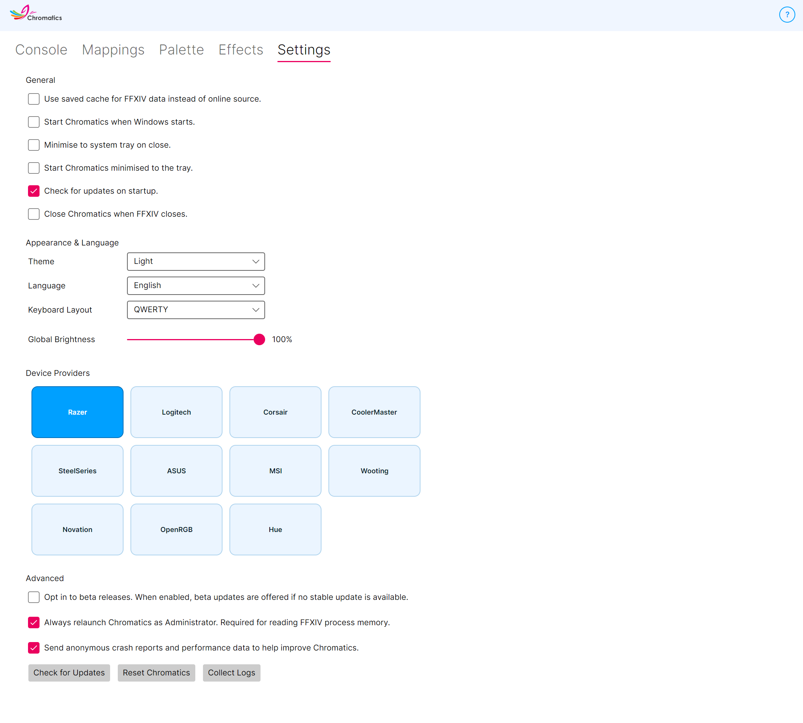

---
metaLinks:
  alternates:
    - https://app.gitbook.com/s/DpGqSy4CPpGNrMRyhQGc/using-chromatics/settings
---

# Settings

<figure><figcaption></figcaption></figure>

The **Settings** tab is where you tune how Chromatics behaves, what devices it talks to, and how the app looks. Chromatics saves your changes automatically.

Settings are grouped into four sections.

* [General](#general) - day-to-day behaviour.
* [Appearance & Language](#appearance-and-language) - theme, language, keyboard layout, global brightness.
* [Device Providers](#device-providers) - which RGB vendors Chromatics connects to.
* [Advanced](#advanced) - beta channel, crash reporting, reset, admin behaviour.

## General

### Start Chromatics when Windows starts

Automatically launches Chromatics when you sign in to Windows. Pair this with **Start Chromatics minimised to the tray** below for a silent boot.

**Default:** Disabled.

### Minimise to system tray on close

When on, clicking the window's red **X** hides Chromatics to the system tray instead of closing it. You can still exit fully by right-clicking the tray icon and choosing **Close**.

**Default:** Disabled.

### Start Chromatics minimised to the tray

When on, launching Chromatics sends it straight to the system tray without ever showing the main window.

**Default:** Disabled.

### Check for updates on startup

Lets Chromatics check for new releases automatically when it starts. New versions download and install in the background, with a quick restart at the end.

**Default:** Enabled.

### Close Chromatics when FFXIV closes

When on, Chromatics will exit automatically a few seconds after Final Fantasy XIV closes. Handy if you launch Chromatics alongside the game and don't want it lingering after you quit.

**Default:** Disabled.

## Appearance and Language

### Theme

Pick **Light**, **Dark**, or **System** (follows your Windows theme). The change applies instantly.

### Language

Chromatics is localised into several languages. Choose yours from the drop-down - the interface text updates immediately.

### Keyboard Layout

Tells Chromatics which physical layout your keyboard uses so key positions are correct. Options are **QWERTY**, **QWERTZ**, and **AZERTY**.

Changing this setting remaps your existing layer key assignments automatically so you don't need to rebuild anything. The virtual keyboard in the Mappings tab also re-renders to match.

**Default:** QWERTY.

### Global Brightness

A master brightness slider that scales every device's output from 0% (off) to 100% (full brightness). Use this to keep Chromatics subtle without editing every palette colour.

**Default:** 100%.

## Device Providers

This section shows a tile for every supported RGB provider. Click a tile to toggle that provider on or off.

Turning a provider off means Chromatics won't try to connect to that vendor's lighting software at all. Handy for troubleshooting: if one vendor's app is misbehaving, you can disable it and keep the others working.

Supported providers:

* Razer
* Logitech
* Corsair
* Cooler Master
* SteelSeries
* Asus
* MSI
* Wooting
* Novation
* OpenRGB
* Philips Hue - searches your network for bridges, pairs, then asks which bulbs to control.
* PlayStation - DualShock 4 and DualSense controllers.
* LIFX - runs a network discovery and asks you which devices to control.
* QMK Keyboards (Beta) - custom keyboards running QMK firmware with Raw HID enabled.
* Yeelight (Beta) - Yeelight bulbs, light strips, and lamps over the local LAN.
* Alienware (Beta) - AlienFX hardware on Alienware and Dell G-series machines.
* Dynamic Lighting (Beta) - any Razer / Logitech G LIGHTSYNC / ASUS ROG / HyperX / MSI / SteelSeries / HP / Omen device Windows exposes via the Dynamic Lighting standard.


We recommend restarting Chromatics after enabling new device providers.


### Philips Hue pairing and adoption

Enabling **Philips Hue** runs a three-step setup: pick a bridge, pair with it, and choose which bulbs Chromatics should control.

**Step 1 - Pick your bridge.**

Chromatics scans your network and lists every Hue bridge it finds. Click **Use this bridge** next to the one you want. Don't see your bridge? Type its IP into the **Bridge IP** box instead.

**Step 2 - Pair.**

1. Press the big round button on top of the Hue bridge.
2. Click **Submit** in the dialog within about 30 seconds.

**Step 3 - Pick your bulbs.**

After pairing, the **Choose Hue lights** dialog lists every bulb on the bridge. Tick the ones you want Chromatics to control, then click **Save**.

Chromatics remembers your bridge and adoption choices, so you won't be asked again unless your bridge's network details change. To change which bulbs are controlled, toggle Hue off and on in this section to re-open the picker.

**Upgrading from an earlier build:** the first time you launch a Chromatics build with the picker, every bulb your bridge exposes is adopted automatically so your existing setup keeps working. From there you can deselect any bulb you don't want from the same dialog.

When Chromatics releases control - you disable Hue in Settings, disable a bulb on the Mappings tab, or close the app - each bulb returns to the colour and on/off state it had before Chromatics took over. Same behaviour as LIFX.

Hue motion is also smoothed for fast-changing effects (Vegas mode, cutscenes, certain weather animations). Chromatics asks the bridge to interpolate between colour frames so bulbs without the Hue Play's hardware fade still get smoother transitions.

### PlayStation controllers

Enabling **PlayStation** lets Chromatics drive the lightbar and the five player-indicator LEDs on **DualShock 4** and **DualSense** controllers. Both **USB** and **Bluetooth** connections are supported, and your controller's input still works normally in games while Chromatics is driving the lights - Chromatics only writes to the lighting, not the input pipeline.

Once enabled, your connected controllers show up on the Mappings tab as standard devices, where you can assign layers to the lightbar and the player LEDs just like any other device.


If your controller is connected but Chromatics says it can't open it, another tool is probably holding it in **exclusive mode**. The usual culprits are **Steam Input**, **DS4Windows**, and **reWASD**. Close that tool (or disable its exclusive mode) before launching Chromatics.


### LIFX devices

Enabling **LIFX** runs a discovery sweep across your local network and opens a picker dialog so you can choose which devices Chromatics should control.

Chromatics talks to LIFX devices using the **Local LAN protocol**. There's no LIFX cloud account, no internet round-trip, and no LIFX login. Your bulbs need to be on the same network as your PC.

The picker shows every LIFX device it found:

* Tick the ones you want Chromatics to control, then click **Save**.
* Click **Search again** if you've just powered on a new device and want it picked up.
* Click **Cancel** to back out without enabling LIFX.

If no devices are discovered, or you save without picking any, the LIFX toggle automatically switches itself back off so you don't end up with an enabled-but-empty provider.

You can re-open the picker any time by toggling LIFX off and on again from this section.

**How LIFX devices appear in Chromatics:**

* **Standard bulbs** - single zone, lit as one colour.
* **Multi-zone strips** (Z, Beam, String, Neon) - addressable per zone, so effects like the HP bar or weather gradients spread across the strip.
* **Matrix devices** (Tile, Candle Color) - mapped as a grid, so 2D effects like the Audio Visualizer and the Reactive Weather animations work on them too.

When Chromatics releases control - you disable LIFX in Settings, or close the app - every device is restored to the colour and on/off state it was in before Chromatics took over. Your bedroom won't be left mid-strobe if you close Chromatics during Vegas mode.

### Yeelight devices (Beta)

Enabling **Yeelight** runs an SSDP discovery sweep and opens a picker dialog so you can choose which bulbs Chromatics should control. Same UX as the LIFX picker.

Chromatics talks to Yeelight devices over the **Yeelight LAN protocol** - no Yeelight cloud account, no third-party DLLs, no proxy software. The protocol is open and documented by Yeelight directly.


Each bulb you want Chromatics to control needs **LAN Control** enabled in the **Yeelight** or **Mi Home** app. Open the app, tap a bulb, and switch on **LAN Control** in its settings. Bulbs without LAN Control enabled won't appear in the picker.


The picker shows every Yeelight device it found:

* Tick the ones you want Chromatics to control, then click **Save**.
* Click **Search again** if you've just powered on a new device and want it picked up.
* Click **Cancel** to back out without enabling Yeelight.

If no devices are discovered, or you save without picking any, the Yeelight toggle automatically switches itself back off.

**How Yeelight devices appear in Chromatics:**

* **Bulbs and lamps** - lit as one colour. Includes Color, White, and tunable-white bulb families.
* **Bedside Lamp 2** and other dual-element lamps - exposed as two LEDs (main and background) so you can map them independently.
* **Light strips** (Lightstrip Plus and similar) - lit as one colour. The Yeelight LAN protocol doesn't expose per-zone addressing on its strips, even on hardware that physically supports it.

**Music Mode** is enabled automatically on every bulb that supports it. Music Mode opens a TCP connection from the bulb back to Chromatics, which removes the bulb's normal cap of 60 commands per minute and lets fast-changing effects (Vegas mode, weather animations) track in real time. If your firewall blocks inbound TCP from the bulb, Chromatics falls back to the slower outbound channel automatically.

### Alienware AlienFX (Beta)

Enabling **Alienware** discovers AlienFX hardware on the HID bus and adopts every device it finds. Covers three families:

* **Zone-based chassis** - Aurora R7-R14 desktops, m15 / m17 / x15 / x17 zone laptops, Dell G7 / G5 / G5SE.
* **Per-key notebook keyboards** - Area51m-R2, x17R2, m15R3 onwards, m17R3, and other m-series notebooks.
* **Per-key external keyboards** - AW510K, AW920K, AW768, AW410K.

Chromatics talks to AlienFX hardware directly via HID. There's no Dell driver to install, no Alienware Command Center dependency, and no precompiled bridge DLL.


**Quit Alienware Command Center first.** AWCC holds the AlienFX HID interface exclusively. While it's running, Chromatics can't open your AlienFX hardware. Right-click the AWCC icon in the system tray and choose **Exit** before enabling the Chromatics provider. The Console will tell you specifically when AWCC is the blocker.


**Per-key keymaps:** Alienware doesn't publish a per-board key-index map for AW510K / AW920K-class boards. Chromatics ships a default ANSI 104 layout that matches most matrix-scan orders, but the firmware on your specific keyboard may enumerate keys in a different order. If your effects light the wrong physical keys, drag them into position via the [Mappings](mappings.md) tab. The mapping persists across restarts.

### Windows Dynamic Lighting (Beta)

Enabling **Dynamic Lighting** picks up any device Windows lists in **Settings → Personalization → Dynamic Lighting**. Microsoft's Dynamic Lighting standard is a cross-vendor HID protocol that's gradually replacing per-vendor RGB SDKs, with confirmed support from Razer (BlackWidow / Huntsman / DeathAdder families), Logitech G LIGHTSYNC, ASUS ROG, HyperX, MSI, SteelSeries, and HP / Omen.

There's no setup dialog or adoption picker. Windows already enumerates compatible devices for you, so Chromatics adopts whatever is showing up under the Dynamic Lighting page in Windows Settings. Each Dynamic Lighting device shows in the Mappings tab tagged "**(Dynamic Lighting)**" and prefixed with its vendor (e.g. "Logitech G512 (Dynamic Lighting)") so it's distinct from the same physical device's entry under its vendor SDK provider.


On first enable, Chromatics shows a setup walkthrough explaining how to make Chromatics the priority controller in **Settings → Personalization → Dynamic Lighting**. Follow those steps for best results during gameplay.



**Turn on Use Dynamic Lighting on my devices** at the top of **Settings → Personalization → Dynamic Lighting**. This is the master switch for the whole Windows Dynamic Lighting system - background control stays off without it, regardless of what's in the Background controllers list below.



**After resetting Chromatics** (Settings → Reset), background Dynamic Lighting needs two launches to come back. The first launch after a reset re-registers Chromatics with Windows but the running process can't pick up the new identity, so background lighting stays off and only foreground writes work. Background control activates on the second launch. Foreground lighting is unaffected on either launch.


**Conflict handling.** If you have a Razer keyboard that's already controlled by the Chromatics Razer provider AND it shows up under Dynamic Lighting, both providers would otherwise race for the device every frame and the lighting could flicker. Default behaviour: Dynamic Lighting adopts every compatible device Windows lists, regardless of overlap. If you see flickering, go to **Settings → Advanced** and turn off **Allow Dynamic Lighting to control devices already covered by another Chromatics provider**. Dynamic Lighting will then silently skip devices that have a vendor provider currently enabled.

If Windows enumerates zero Dynamic Lighting devices on enable (no compatible hardware, or every device is hidden by the conservative conflict-handling above), Chromatics flips the toggle back off and surfaces a dialog explaining what to check.

### QMK Keyboards (Beta)

Enabling **QMK Keyboards** scans the USB bus for keyboards running QMK firmware with Raw HID enabled and adopts every compatible board it finds. Covers custom keyboards from NovelKeys, KBDFans, Drop, GMMK, Glorious, and any other brand running QMK.

Chromatics drives QMK boards through one of two protocols, picked per board:

* **OpenRGB-QMK firmware module** - if your firmware has the OpenRGB-QMK module compiled in, Chromatics gets full per-key control via direct mode.
* **VIA** - the universal fallback. Chromatics controls the firmware's built-in RGB matrix base colour and effect mode through VIA's configuration commands.

A pre-built key layout database covering 2650 QMK boards ships with Chromatics so per-key effects (Highlight, Keybind) map to the correct physical keys on boards running the OpenRGB-QMK firmware module. The database doesn't apply to VIA-only firmware - VIA's protocol can't address individual LEDs regardless of layout data, so Chromatics drives the board as a single zone. OpenRGB-QMK boards outside the bundled database fall back to Custom1..N - position them via the Mappings tab.


**Close VIA, Vial, or OpenRGB before enabling.** All three open the Raw HID interface exclusively while they're running. Chromatics can't share the interface with them.



**Per-LED control needs custom firmware.** Stock QMK firmware (including Keychron vendor builds) lands on the VIA protocol path, which only exposes one RGB matrix base colour for the whole device. The device acts as a single zone - every LED glows the same colour at any moment, even when Chromatics layers paint per-LED. Per-LED control needs the **OpenRGB-QMK firmware module** compiled into your QMK build. It's a third-party add-on, not part of stock QMK; you compile it into a custom QMK firmware image and flash that onto your device yourself. Once flashed, Chromatics's handshake detects the module on the next launch and switches the device to per-LED direct mode.

Chromatics does not provide instructions, support, or pre-built firmware images for the OpenRGB-QMK firmware module. Building and flashing custom firmware is between you, your device's QMK keymap, and the OpenRGB-QMK project. A bad flash can brick a device - only attempt this if you can recover from one. See [Troubleshooting → My QMK keyboard shows one colour at a time instead of per-key](../support/troubleshooting.md#my-qmk-keyboard-shows-one-colour-at-a-time-instead-of-per-key) for the build flags and source files involved.


## Advanced

### Opt in to beta releases

When on, Chromatics also checks the beta update feed and installs beta builds if they're newer than the current stable release. See [Beta Releases](../getting-started/beta-releases.md).

**Default:** Disabled.

### Always relaunch Chromatics as Administrator

Chromatics needs admin privileges to read FFXIV memory. When on, Chromatics will silently relaunch itself with admin rights instead of showing the usual relaunch prompt.

**Default:** Disabled.

### Send anonymous performance and error telemetry

Lets Chromatics send anonymous crash reports to help us catch and fix bugs faster. **Chromatics never sends any personally identifying information** - just the crash itself, the app version, and basic environment info. If Chromatics crashes, a small dialog appears where you can add a comment describing what you were doing and choose whether to send the report. This dialog always appears whether you've opted in or out, and sending is always your choice.

**Default:** Enabled.

### Check for Updates

Runs an update check immediately. If a new version is available, Chromatics will download and install it.

### Reset Chromatics

Resets Chromatics back to defaults. All of your config files in `%AppData%\Chromatics\` are removed. You'll need to restart Chromatics afterwards and go through the First Run wizard again. Consider [exporting your layers and palettes](mappings.md) first if you'd like to keep them.

### Collect Logs

Bundles your diagnostic data into a single ZIP at a location of your choosing. Attach this ZIP when asking for support on Discord or GitHub - it gives us everything we need to help.

The ZIP contains:

* The current Console tab as `console.log`, plus the rotating `verbose.log` from `%AppData%\Chromatics\`.
* `system-info.txt` - Chromatics version, OS, .NET runtime, architecture, install kind, install / config folder paths, your Windows machine name, and your Windows username.
* A `config/` folder with copies of your `layers`, `palette`, `effects`, and `settings` `.chromatics4` files (plus any legacy `.chromatics3` files).

The `settings.chromatics4` file includes any Philips Hue bridge IP and bridge key, and your LIFX and Yeelight adopted-device lists. Chromatics never sends this ZIP automatically; you choose where to save it and who to share it with. See the [Privacy Policy](../privacy.md#diagnostic-log-bundles-you-choose-to-share) for the full breakdown.

## Where are the old "Advanced Settings"?

A handful of deeper options that used to require editing `settings.chromatics3` by hand are now exposed in the UI (keyboard layout, global brightness, beta opt-in, admin elevation, device provider toggles). The only settings that still live in the file are very niche tuning values and can be changed by editing `settings.chromatics4` in `%AppData%\Chromatics\` while Chromatics is closed.

<table><thead><tr><th width="320">Setting</th><th>Description</th></tr></thead><tbody>
<tr><td><code>rgbRefreshRate</code></td><td>Refresh rate (in seconds) of the RGB rendering surface. Default <code>0.05</code>. Lower values are smoother but use more CPU. Values below <code>0.05</code> are not recommended. <em>Takes effect on restart.</em></td></tr>
<tr><td><code>criticalHpPercentage</code></td><td>The HP percentage at which the HP Tracker switches to its critical colour. Default <code>20.0</code>.</td></tr>
<tr><td><code>deviceHueBridgeIP</code></td><td>The Hue bridge address. Normally set automatically during pairing, but can be filled in by hand if you're restoring a backup.</td></tr>
<tr><td><code>openRgbServerIp</code></td><td>IP address of the OpenRGB SDK server Chromatics connects to when the OpenRGB provider is enabled. Default <code>127.0.0.1</code> (local machine). Set this to another machine's IP on your LAN to drive lighting from a remote OpenRGB instance. Port is fixed at 6742. <em>Takes effect on restart, or when the OpenRGB provider toggle is flipped off then back on.</em></td></tr>
</tbody></table>


Close Chromatics before editing <code>settings.chromatics4</code> by hand, or Chromatics will overwrite your changes the next time it saves.

